# FerryLight System: A Comprehensive Briefing

## Executive Summary

FerryLight is a comprehensive, real-time community information system designed for the Englishtown ↔ Jersey Cove ferry route in Nova Scotia, Canada. The system's primary objective is to eliminate travel uncertainty by providing live ferry status, vessel tracking, and wait time estimations, thereby helping users decide between waiting for the 3-5 minute ferry ride or taking the alternative 25-minute St. Ann's Loop. Beyond ferry monitoring, FerryLight functions as a central community hub, integrating local weather data, community event calendars, a directory of local businesses, and even marine wildlife tracking.

The system is built on a modern, layered architecture featuring a React Progressive Web App (PWA) for user access and a unique physical WLED matrix display for at-a-glance status, aimed particularly at older residents. Data is ingested from diverse sources, including a local AIS receiver, a weather station, Google Sheets, and various APIs. This data is processed and orchestrated by a Node-RED integration hub, with an Express.js backend and a PostgreSQL database providing persistence and an API gateway. The entire system is containerized with Docker and deployed on a VPS, showcasing a robust, scalable, and resilient design for delivering critical, real-time information to a local community.

---

## 🎧 Listen to the FerryLight Podcast

Prefer to listen? Here's a podcast overview of the FerryLight system:

🎧 **[Listen to the Deep Dive Podcast with Markus](assets/FerryLightDeepDivePodcastWithMarkusv1.mp3)** *(Click to download/play)*

*Deep Dive Podcast: Markus discusses the FerryLight real-time community information system*

---

## 1. Project Overview and Purpose

FerryLight is a multi-faceted real-time monitoring and information system focused on the Englishtown ↔ Jersey Cove ferry service in Nova Scotia. The project, currently in Beta as version 5.2.6, was created by Markus van Kempen to address the practical challenge faced by the local community: the uncertainty of the ferry's operational status. A service disruption requires a 22-25 minute detour via the St. Ann's Loop, making real-time information highly valuable.

The system has evolved from a simple status checker into a comprehensive community resource, combining official government data with information from a custom-built DIY weather station and local sensors.

| Property | Value |
|----------|-------|
| **Project Name** | FerryLight |
| **Version** | 5.2.6 (Beta) |
| **Author** | Markus van Kempen |
| **Production URL** | https://ferrylight.online |
| **GitHub Repository** | markusvankempen-ai/FerryLight |

### Location & Maps

| Location | Description | Map Link |
|----------|-------------|----------|
| **Englishtown Ferry** | Ferry crossing at Englishtown/Jersey Cove | [View on Google Maps](https://www.google.com/maps/place/Englishtown+Ferry/@46.2881914,-60.5836724,12.69z) |
| **St. Ann's Loop** | Alternate 25-minute route when ferry is down | [View Alternate Route](https://www.google.com/maps/dir/46.3477059,-60.5361775/46.2082839,-60.5940043/@46.2080559,-60.5943418,12z) |

**GPS Coordinates:**
- Englishtown Terminal: 46.2889°N, 60.5400°W
- Jersey Cove Terminal: 46.2882°N, 60.5837°W

---

## 2. Core Features and Functionality

The FerryLight system offers a wide array of features that extend beyond basic ferry tracking, establishing it as a central hub for community information.

| Feature Category | Description |
|------------------|-------------|
| 🚢 **Real-Time Ferry Tracking** | Utilizes AIS (Automatic Identification System) data to provide live status updates and position tracking of the primary ferry, the TORQUIL MACLEAN (MMSI: 316023888). An interactive Leaflet map displays the vessel's real-time position. |
| 🌤 **Weather Integration** | Aggregates data from a local weather station and supplements it with critical alerts from Environment Canada. Users can view temperature, humidity, wind speed/direction, UV index, and pressure. |
| 📅 **Community Events** | Acts as a community calendar, integrating with Google Calendar and Google Sheets to display local events, garbage schedules (Mon for Englishtown, Tue for Northshore), Nova Scotia holidays, church services, and music events. |
| 💡 **LED Physical Display** | A key feature is a physical WLED-based LED matrix display designed to show ferry status, wait times, and weather alerts. This component specifically targets older community members who may not use the web application. |
| 📱 **Progressive Web App (PWA)** | The primary user interface is an installable PWA with offline support, ensuring access to cached data even without an internet connection. It is compatible with desktop, Android, and iOS devices. |
| 🔔 **Push Notifications** | A smart, multi-category notification system sends alerts for critical events like ferry service suspensions/resumptions, new weather warnings, and new community announcements. |
| 🦈 **Maritime Environment Monitoring** | The system tracks all AIS-equipped vessels in the area, including tour boats and fishing vessels. It also integrates with the OCEARCH API to display the last known positions of tagged marine animals, primarily sharks. |
| ✈️ **Aircraft Tracking** | As an additional feature, the application tracks and displays planes in the St. Ann's Bay area using ADS-B (Automatic Dependent Surveillance–Broadcast) data. |
| 🎵 **Cape Breton Music** | A fun feature for users waiting in the ferry lineup! The app includes a "Play a Tune" button that offers a curated selection of traditional Cape Breton Celtic fiddle tunes. Perfect for enjoying Nova Scotia culture while you wait for your crossing. |
| 🛍️ **FerryLight Shop** | A new e-commerce section allowing users to purchase FerryLight-branded merchandise like t-shirts, mugs, and caps. Features an integrated shopping cart, calculated shipping, and secure Stripe payments. |
| 🏰 **Attractions Directory** | Provides a directory of local attractions, shops, and services in the Northshore area to help visitors discover the region. |

---

## 3. System Architecture and Technology Stack

FerryLight is built on a layered architecture designed for real-time data flow, resilience, and scalability. The architecture can be broken down into four primary stages: data ingestion, integration/processing, backend/persistence, and client presentation.


*System overview showing key features and the "Signal to Screen" data flow*

### 3.0. System Architecture Diagram

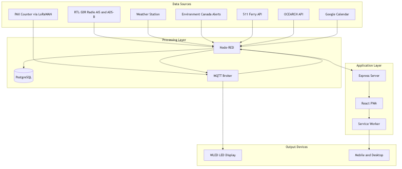
*FerryLight system architecture showing data flow from sources through processing to clients*

### 3.1. Architectural Flow: From Signal to Screen

1. **Data Sources**: Real-world signals are captured from diverse sources like an AIS antenna, a local weather station, and web APIs.
2. **Integration & Processing**: Node-RED acts as a central hub to ingest, process, enrich, and route this raw data.
3. **Backend & Persistence**: An Express.js server provides an API gateway and business logic, while a PostgreSQL database stores historical data and current state.
4. **Clients & Consumers**: The processed information is delivered to end-users via the React PWA, the physical WLED display, and push notifications.

### 3.2. Data Ingestion Sources

- **AIS Radio Receiver**: A local RTL-SDR receiver captures real-time AIS signals at 161.975/162.025 MHz.
- **Local Weather Station**: Provides real-time local weather metrics.
- **Environment Canada**: Public feeds are used for official weather alerts.
- **Google Sheets & Calendar**: Serve as a simple CMS for community events, announcements, and schedules.
- **OCEARCH API**: Provides live tracking data for tagged marine wildlife.
- **511 Ferry Status API**: An external source for ferry status information.

### 3.3. Integration Hub: Node-RED

Node-RED is the "central nervous system" of the architecture, handling critical data orchestration tasks.

- **Data Ingestion & Routing**: Acts as the primary endpoint for AIS signals and weather data.
- **Real-Time Logic**: Performs location-based status determination using a 30m geofence around ports to automatically track trip starts and ends.
- **Data Enrichment**: Processes raw AIS data to extract key fields (MMSI, position, speed) and formats it for storage and API delivery.
- **Analytics Engine**: Calculates operational metrics like hourly trip counts.
- **Communication Gateway**: Manages push notification subscriptions and bridges data to the MQTT message bus for IoT devices.

### 3.4. Backend and Persistence

#### Express.js Backend Server
- **API Gateway**: Provides a set of RESTful endpoints for the frontend application.
- **Proactive Monitoring**: A background process polls for system state changes every 2 minutes to identify events and trigger notifications.
- **Business Logic**: Executes server-side logic, including the 3-factor Smart Busyness Analysis Algorithm.
- **Proxy**: Includes a WebSocket proxy to the WLED display.

#### PostgreSQL Database

Serves as the system's memory, providing a structured repository for both ephemeral real-time positions and long-term service records.

| Table Name | Purpose |
|------------|---------|
| `ais_data` | Stores raw, historical AIS messages for all tracked vessels. |
| `ais_latest_positions` | An optimized table holding only the most recent position for fast lookups. |
| `ferry_outages` | A dedicated log of all service interruptions and resumptions with timestamps. |
| `push_subscriptions` | Securely stores user subscription endpoints for the Web Push API. |
| `orders` | Manages e-commerce order information. |
| `audit_trail` | Logs significant system changes and events. |

### 3.5. Technology Stack Summary

| Layer | Technology |
|-------|------------|
| Frontend | React 18, Styled Components, Framer Motion, Leaflet |
| Backend | Node.js, Express.js |
| Integration | Node-RED |
| Database | PostgreSQL |
| Messaging | MQTT, WebSockets |
| Push | Web Push API, VAPID |
| Containerization | Docker, Docker Compose |
| Reverse Proxy | Traefik |
| PWA | Service Workers, Web App Manifest |

### 3.6. MQTT Topic Structure

Real-time event distribution for IoT devices uses the following topic hierarchy:

```
MQTT Topics:
├── ferrylight/status       → Ferry operational status
├── ferrylight/position     → Current GPS position
├── ferrylight/wled/text    → LED display text
├── ferrylight/weather      → Weather updates
└── ferrylight/alerts       → System alerts
```

### 3.7. Data Flow Summary

```
1. AIS Receiver → Node-RED → PostgreSQL → API → React App
2. Weather Station → Node-RED → API → React App
3. Ferry Service API → Node-RED → API → React App
4. OCEARCH API → Node-RED → API → FerryMap Component
5. PAX Counter → LoRaWAN Gateway → MQTT → Node-RED → API
6. Node-RED → MQTT → WLED Display
7. Server → Web Push → Service Worker → Mobile Notification
8. Google Calendar → Node-RED → Events API → Events Component
```

---

## 4. Key Technical Implementations

### 4.1. Push Notification System

The system uses the Web Push API with VAPID authentication. A server-side monitoring loop checks for status changes every two minutes and sends deduplicated notifications. Recent updates (v5.2.6) improved reliability by ensuring notifications link correctly to the live site and prevented duplicate announcements.

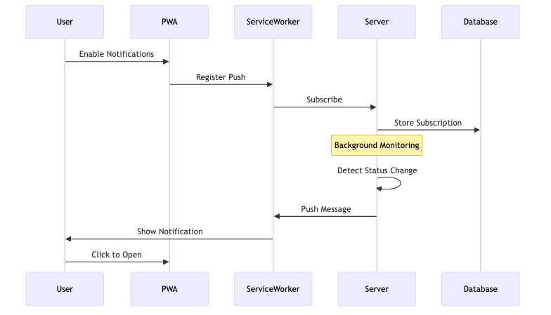
*Push notification system flow from user subscription to notification delivery*

| Category | Notification Types | Priority |
|----------|-------------------|----------|
| **Ferry** | Suspended, Resumed, Daily Outage Reminder | Critical/High |
| **Weather** | New Alert Issued, Alert Cleared | Medium |
| **Events** | New Community Announcements (via EventsSheetEmail) | Medium |
| **Orders** | E-commerce Order Confirmation, Shipping Updates | Low |

### 4.2. Physical WLED Display

This IoT component extends the digital service into the physical world.

- **Purpose**: To provide at-a-glance ferry status for residents, especially older individuals, who may not use the web app. It is designed to be placed at key junctions roughly a 10-minute drive from the ferry.
- **Hardware**: WLED-compatible ESP32 or ESP8266 controller with a 32x8 or 64x8 pixel LED matrix.
- **Setup**: Users connect to a "FerryLight" WiFi network broadcast by the device to configure it for their home network via a dedicated setup web app. Status LEDs indicate the mode:
  - 🔴 **RED** - Setup mode
  - 🔵 **BLUE** - Test mode
  - 🟢 **GREEN** - Complete
- **Updates**: An MQTT-to-WebSocket bridge in Node-RED pushes real-time status updates as JSON commands, which the display shows as scrolling text.

### 4.3. Business Logic and Algorithms

#### Weather Cancellation Rules

Ferry service is automatically flagged for cancellation under specific conditions:
- Wind speed > 50 km/h
- Visibility < 1 km
- Wave height > 3 meters
- Presence of ice conditions

#### SEO & Sitelinks

To improve discoverability, the system now implements comprehensive Schema.org structured data (JSON-LD), including `WebSite` and `SiteNavigationElement`. This allows search engines like Google to display rich Sitelinks, helping users navigate directly to key pages like Weather or Status.

#### Smart Busyness Algorithm

A three-factor scoring system estimates wait times:

| Factor | Weight | Description |
|--------|--------|-------------|
| Trip Frequency | 60% | Compares current trips to the expected number |
| Docking Efficiency | 30% | Measures turnaround times at the dock |
| Historical Context | 10% | Compares current activity to the weekly average |

**Busyness Score Mapping:**
- **0-25**: 🟢 Quiet
- **26-50**: 🟡 Normal
- **51-75**: 🟠 Busy
- **76-100**: 🔴 Very Busy

---

## 5. Deployment and Operations

The entire system is containerized for resilience and ease of management, deployed on a Virtual Private Server (VPS).

- **Containerization**: Docker and Docker Compose are used to orchestrate the services (`ferrylight-app`, `postgres`, `nodered`, `traefik`, `mailserver`).
- **Docker Images**: Multiple Dockerfiles are available for different use cases, ranging from a ~250MB development image to a secure, ~100MB distroless production image.
- **Deployment**: A `deploy.sh` script handles the deployment process, which involves cloning the GitHub repository, configuring environment variables (`.env`), and running `docker-compose`.
- **Reverse Proxy**: Traefik is used for SSL termination and domain routing.

---

## 6. Operational Challenges and Future Developments

### 6.1. Identified Challenges

- **Hardware Reliability**: The local weather station is prone to freezing during winter.
- **Infrastructure**: The system is vulnerable to local internet connection and power outages.
- **Data Integrity**: The ferry captain occasionally forgets to turn on the AIS signal, requiring intervention from authorities (e.g., Coast Guard).
- **Data Sourcing**: Finding reliable government RSS feeds for information like weather alerts and fire bans is a persistent challenge.

### 6.2. Future Development: PAX Counters

> **Note:** FerryLight is currently in Beta (v5.2.6). The PAX Counter system was successfully tested in summer 2025 and is planned for full deployment in summer 2026.

To improve the accuracy of wait time estimations, a system of PAX counters is being developed.

- **Problem**: The ferry has a limited capacity of 15 cars. During peak tourist season, lineups can be long, and AIS data alone cannot determine the number of waiting vehicles.
- **Solution**: PAX counters will be deployed at each port to count Bluetooth and WiFi signals from devices in waiting cars, providing an indication of how busy each port is.
- **Technology**: Due to a lack of power and internet at the ports, the counters will transmit data via LoRaWAN. This data will be combined with AIS trip counts to calculate more precise wait times.
- **Status**: Initial testing completed in 2025. Full implementation scheduled for summer 2026.

---

## 7. LED Setup Application

A dedicated web application is provided for configuring the WLED LED displays.

**Access URL**: [https://led-setup.ferrylight.online](https://led-setup.ferrylight.online)

### Setup Process

1. **Power On** the FerryLight LED device
2. **Connect** to the "FerryLight" WiFi network broadcast by the device
3. **Open** the setup app at the URL above (or `http://4.3.2.1` when directly connected)
4. **Enter** your home WiFi credentials (SSID and Password)
5. **Configure** and the device will restart and connect to your network

### LED Display in Action

The LED matrix display shows ferry status, destination, and wait times:

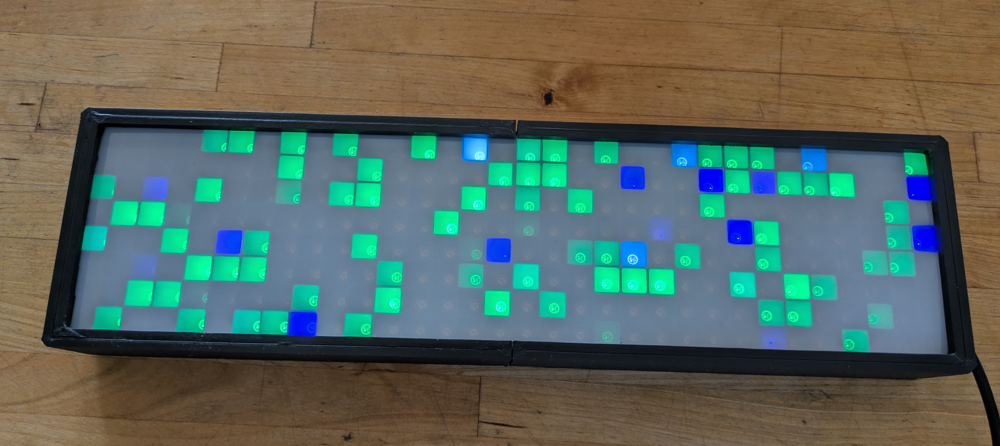
*LED display showing test pattern in setup mode*

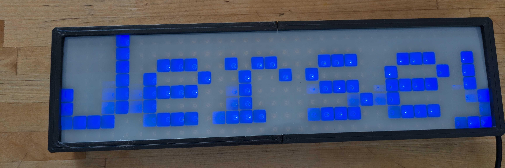
*Display showing "Jersey" - indicating ferry heading to Jersey Cove*


*Display showing "Engli..." - scrolling ferry heading to Englishtown*

### LED Display Video Demo

<video controls width="100%" style="max-width: 600px;">
  <source src="images/led_display_demo.mp4" type="video/mp4">
  Your browser does not support the video element.
</video>

*Video demonstration of the FerryLight LED display showing real-time ferry status updates*

---

## 8. Email Notification System

The system includes a Docker Mail Server for transactional emails.

### Email Types

| Type | Recipients | Purpose |
|------|-----------|---------|
| **Order Confirmation** | Customers | Purchase confirmation with order details |
| **Admin Alerts** | admin@ferrylight.online | New order notifications |
| **Weather Alerts** | Subscribers | Critical weather warnings |

### Technical Details

- **Mail Server**: Docker Mail Server container
- **Template Engine**: Plain text with templating
- **Error Handling**: Graceful degradation - orders continue if email fails

---

## 9. Visual Gallery

### Road Signage


*Ferry status sign on NS-312 at the St. Ann's Loop junction, just past St Ann's Church*

This "Ferry NOT Operating When Flashing" sign is located approximately 10 minutes from the ferry terminal, positioned at the junction leading to the St. Ann's Loop. The sign provides early warning to drivers approaching from Cape Breton Highlands: when the amber light is flashing, the ferry is out of service and drivers should take the alternative 25-minute route via the St. Ann's Loop. This helps prevent unnecessary trips to the ferry terminal only to discover the service is suspended.

---

### The Ferry

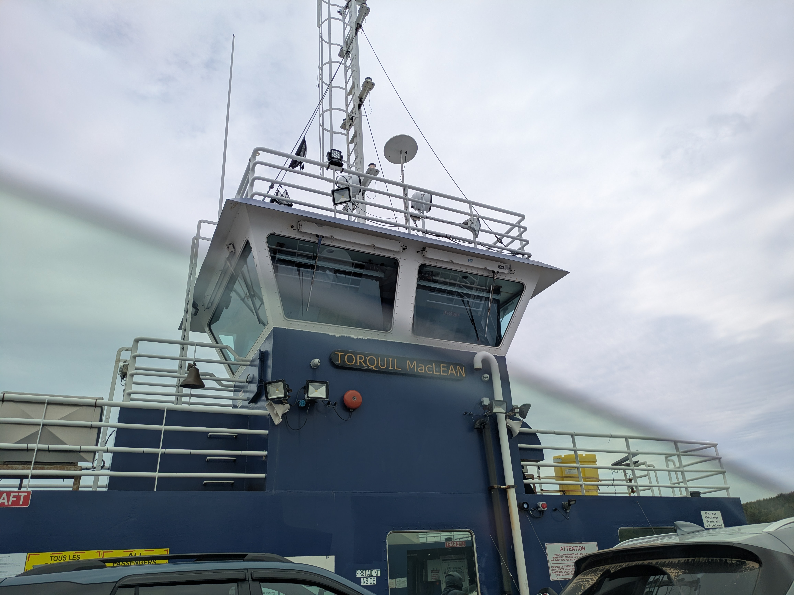
*The Torquil MacLean ferry crossing St. Ann's Bay*

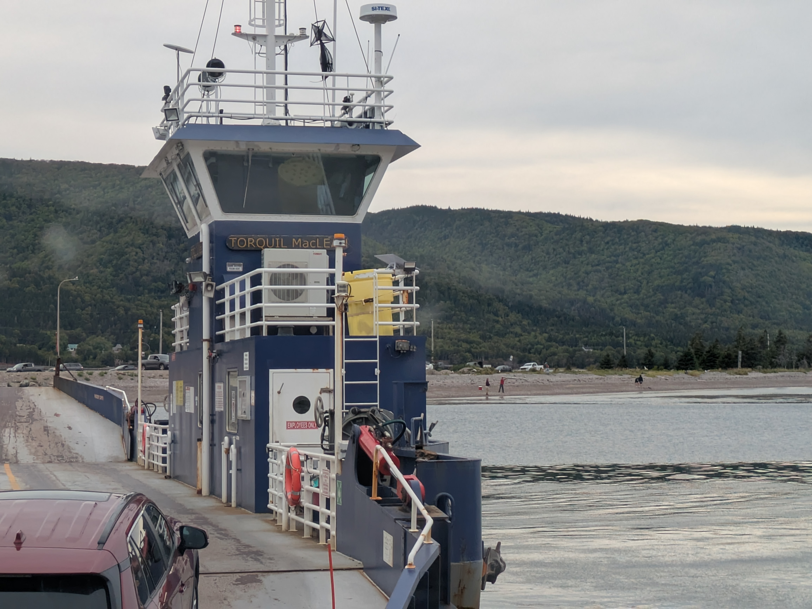
*Vehicles boarding the ferry at Englishtown terminal*

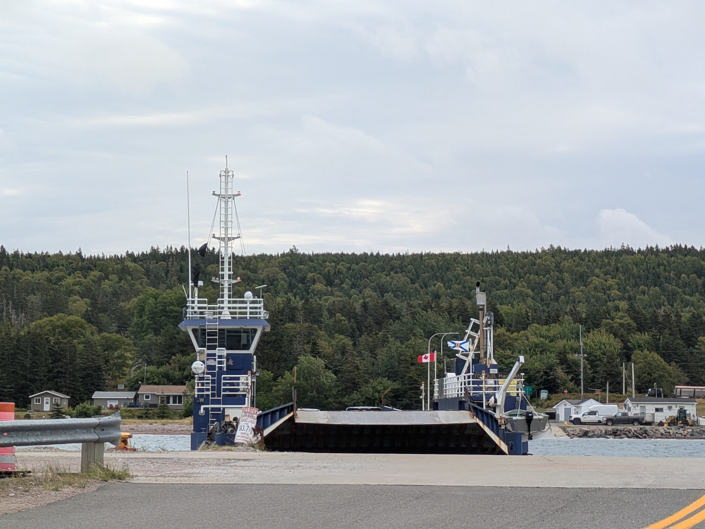
*Ferry approaching the Jersey Cove dock*

### Web Application Screenshots


*Main ferry status page showing real-time position and status*

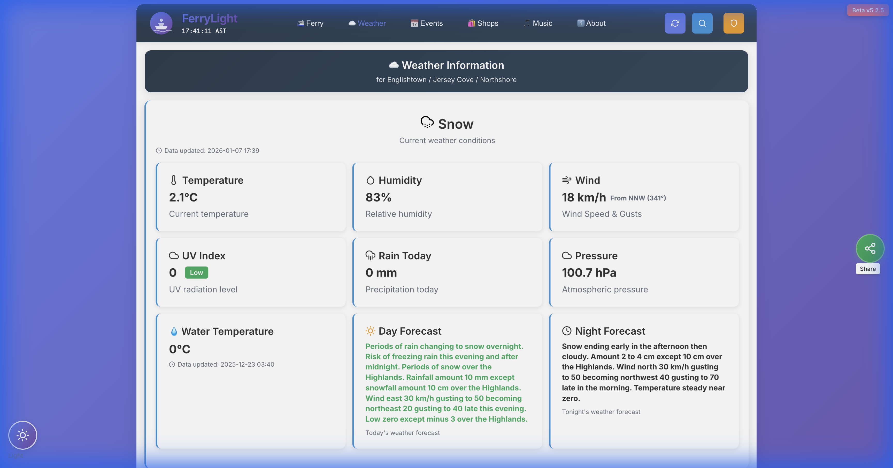
*Weather page with current conditions and alerts*

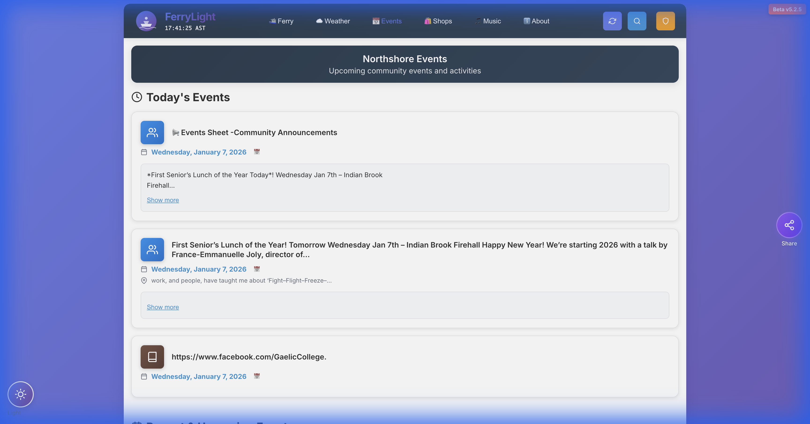
*Community events calendar with garbage schedules*

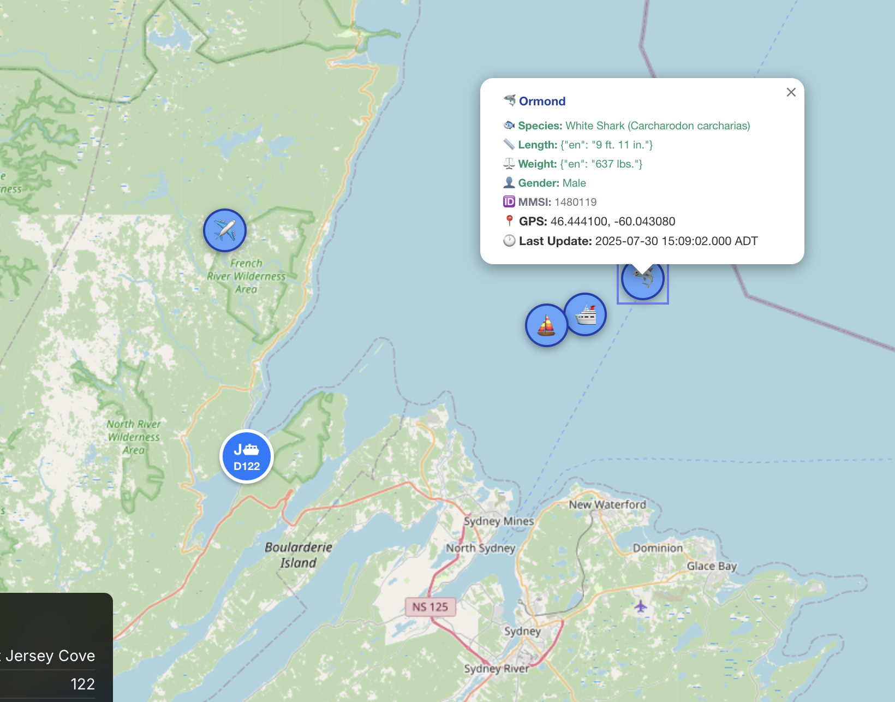
*Interactive map showing vessels, aircraft, and marine animals*

### FerryLight Shop


*New online shop offering FerryLight branded merchandise with secure checkout*

---

## Appendix A: System Architecture Diagram


*Detailed system architecture showing all components and data flow*

---

## Appendix B: Data Flow Sequence

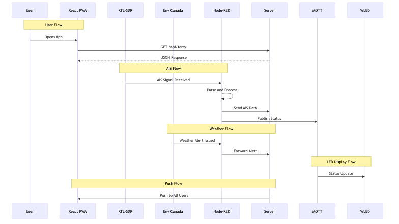
*Data flow sequence showing user, AIS, weather, and output flows*

---

## Appendix C: Docker Service Topology

| Service | Purpose | Image |
|---------|---------|-------|
| `ferrylight-app` | React PWA + Express API | Custom build |
| `postgres` | PostgreSQL database | postgres:15 |
| `nodered` | Integration flows | nodered/node-red |
| `traefik` | Reverse proxy + SSL | traefik:v2 |
| `mailserver` | Email service | docker-mailserver |
| `led-setup` | LED configuration app | Custom build |

---

## Quick Links

### 🚢 Main Application Pages

| Page | Description | Link |
|------|-------------|------|
| **Ferry Status** | Real-time ferry tracking and wait times | [ferrylight.online/ferry](https://ferrylight.online/ferry) |
| **Weather** | Current conditions and Environment Canada alerts | [ferrylight.online/weather](https://ferrylight.online/weather) |
| **Events** | Community calendar and garbage schedules | [ferrylight.online/events](https://ferrylight.online/events) |
| **About** | Project information and settings | [ferrylight.online/about](https://ferrylight.online/about) |

### 📚 Information & History

| Page | Description | Link |
|------|-------------|------|
| **Ferry History** | The fascinating history of the Englishtown Ferry | [Englishtown Ferry History](https://ferrylight.online/englishtown-ferry-history.html) |
| **Alternate Route** | Guide to the St. Ann's Loop alternate route | [Alternate Route Guide](https://ferrylight.online/alternate-route-englishtown-ferry.html) |
| **Ferry FAQ** | Frequently asked questions about the ferry | [Ferry FAQ](https://ferrylight.online/englishtown-ferry-faq.html) |
| **General FAQ** | General questions about FerryLight | [General FAQ](https://ferrylight.online/faq) |

---

## 🛒 Support the Project

Want your own FerryLight LED Display? You can order one to have ferry status right in your home!

| Option | Description | Link |
|--------|-------------|------|
| **Order LED Display** | Get your own FerryLight LED display for real-time ferry status | [Purchase](https://ferrylight.online/purchase) |
| **Buy Me a Coffee** | Support the developer and help keep FerryLight running | [Buy a Coffee ☕](https://ferrylight.online/purchase) |

---

*FerryLight - Real-Time Ferry Status & Community Information for Cape Breton*

**Website**: [https://ferrylight.online](https://ferrylight.online)  
**LED Setup**: [https://led-setup.ferrylight.online](https://led-setup.ferrylight.online)  
**Author**: Markus van Kempen  
**Contact**: markus.van.kempen@gmail.com

